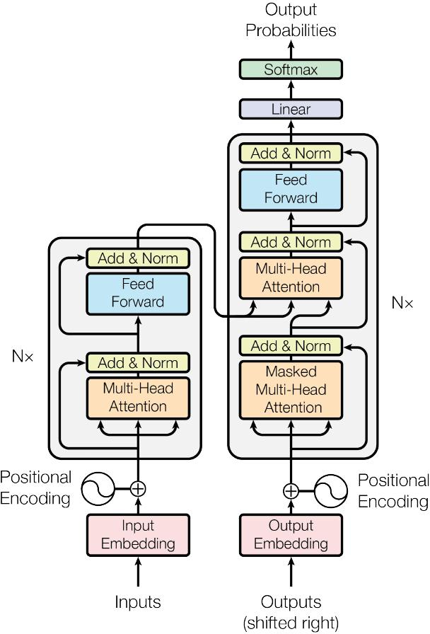

     
RAG 

## Sample output for the Query from the RAG system

### code

        response = chain_with_sources.invoke(
            "explain The Transformer- model architecture in 50 words and image"
        )

        print("Response:", response['response'])

        print("\n\nContext:")
        for text in response['context']['texts']:
            print(text.text)
            print("Page number: ", text.metadata.page_number)
            print("\n" + "-"*50 + "\n")
        for image in response['context']['images']:
            display_base64_image(image)

### Output: 
Response: The Transformer model architecture is shown in the image, which consists of an encoder and a decoder. The encoder takes input embeddings and applies self-attention mechanisms, while the decoder generates output probabilities based on the encoder's output. The architecture relies entirely on attention mechanisms, allowing for parallelization and achieving state-of-the-art translation quality. 

Here is a 50-word explanation of the Transformer model architecture with reference to the image:

The Transformer model architecture consists of an encoder (left) and decoder (right). The encoder applies self-attention to input embeddings, while the decoder generates output probabilities. The architecture uses multi-head attention, feed-forward layers, and positional encoding, as shown in the image, to achieve state-of-the-art translation quality.

Context:
Figure 1: The Transformer - model architecture.
Page number:  3

--------------------------------------------------

In this work we propose the Transformer, a model architecture eschewing recurrence and instead relying entirely on an attention mechanism to draw global dependencies between input and output. The Transformer allows for significantly more parallelization and can reach a new state of the art in translation quality after being trained for as little as twelve hours on eight P100 GPUs.
Page number:  2

--------------------------------------------------

The Transformer follows this overall architecture using stacked self-attention and point-wise, fully connected layers for both the encoder and decoder, shown in the left and right halves of Figure 1, respectively.
Page number:  2

--------------------------------------------------

